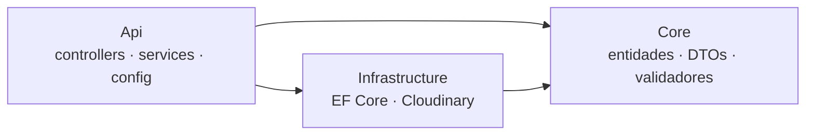
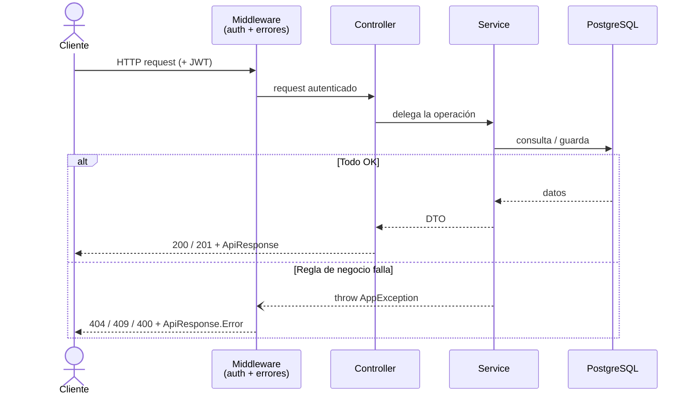
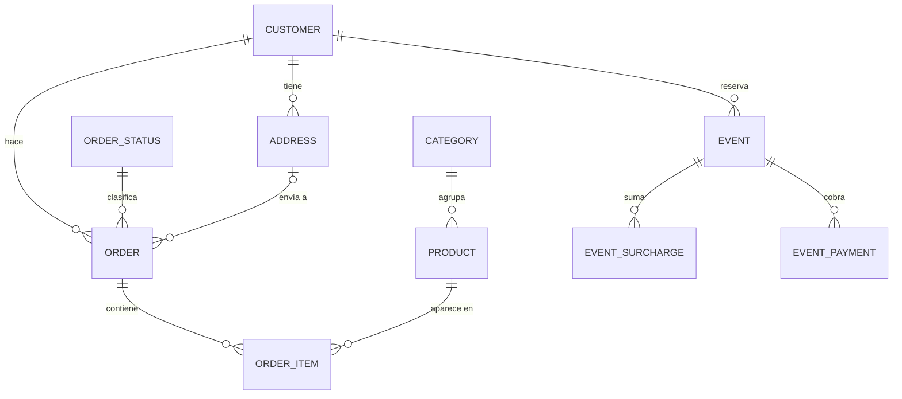

# 🍕 Pizzas Furiosas — API

API REST en **.NET 8 / ASP.NET Core** que sostiene la landing y el panel de administración de una pizzería real. Gestiona productos, categorías, clientes, pedidos, eventos, compras y métricas del negocio, con autenticación por JWT.

> Parte del proyecto full-stack [Pizzas Furiosas](../README.md).

---

## 🛠️ Stack

- **.NET 8** (ASP.NET Core, controllers)
- **Entity Framework Core** + **PostgreSQL** (Npgsql)
- **JWT** para autenticación · **FluentValidation** (mensajes en español)
- **Cloudinary** para imágenes de productos
- **xUnit** + **Testcontainers** para tests de integración
- **Docker** para la base en desarrollo

---

## 🧱 Arquitectura

Solución en 3 capas, con las dependencias apuntando siempre hacia el dominio:



| Proyecto | Responsabilidad |
|---|---|
| **Core** | Dominio puro: entidades, DTOs, validadores. No depende de nadie. |
| **Infrastructure** | Detalles externos: `AppDbContext` (EF Core), migraciones, Cloudinary. |
| **Api** | HTTP: controllers, services de negocio, config, manejo de errores. |

### Flujo de un request



- **Controllers finos:** solo reciben el request, delegan en un service y devuelven el código HTTP. Sin lógica de negocio adentro.
- **Services planos:** cada entidad tiene su `XService` (`ProductService`, `OrderService`, …) que concentra la lógica y toma el `AppDbContext` directo. Devuelven DTOs, nunca entidades.
- **Errores como excepciones de dominio:** los services lanzan `NotFoundException`, `ConflictException`, `BadRequestException` o `UnauthorizedException`. Un único middleware (`UseAppExceptionHandler`) las traduce al código HTTP correspondiente. El "camino feliz" queda limpio, sin `if` de control de errores repartidos.

### Estructura de `Api/`

```
Api/
├── Controllers/    → un controller fino por recurso
├── Services/       → la lógica de negocio (uno por entidad)
├── Exceptions/     → AppException + excepciones de dominio (mapean a HTTP)
├── Configuration/  → settings tipados (JwtSettings)
├── Extensions/     → armado del pipeline y del contenedor de DI
└── Program.cs      → punto de entrada (índice de arranque, ~30 líneas)
```

---

## 🗂️ Modelo de dominio



- Un **pedido** (`ORDER`) pertenece a un cliente y a un estado, opcionalmente tiene una dirección de envío, y se compone de ítems (`ORDER_ITEM`) que congelan el precio del producto al momento de la compra.
- Un **evento** (catering) suma viáticos (`EVENT_SURCHARGE`) y pagos parciales (`EVENT_PAYMENT`).
- `PURCHASE` (gastos) y `USER` (usuarios del panel) son independientes del resto.
- Todas las entidades usan **borrado lógico** (`IsDeleted`), nunca se eliminan físicamente.

---

## 🧭 Decisiones de diseño

- **Services planos en vez de CQRS/Command-Result.** Para el tamaño del proyecto, una capa de servicios simple es más legible y mantenible que el patrón Command/Result con interfaces. Se priorizó claridad.
- **Errores esperados como excepciones de dominio (decisión pragmática).** Los errores de negocio (no encontrado, conflicto, dato inválido) se modelan como excepciones que un único middleware traduce a HTTP. Es una elección por **simplicidad y consistencia** frente al *Result pattern* —más explícito, pero con más ceremonia de la que este proyecto necesita—. Cada `AppException` lleva su `StatusCode`, así que sumar un caso nuevo es solo crear una clase (Open/Closed).
- **DTOs en las respuestas.** Nunca se expone una entidad de EF hacia afuera (evita filtrar campos como `IsDeleted`).
- **Soft delete + índice único parcial.** Las entidades no se borran físicamente (`IsDeleted`); los índices únicos de nombre son parciales (`WHERE IsDeleted = false`) para no chocar con filas ya borradas.
- **Configuración tipada.** El JWT se lee una vez al arrancar en un `JwtSettings`, con fallo temprano y claro si falta la clave.
- **Respuestas uniformes.** Todo se envuelve en `ApiResponse<T>` (`success`, `data`, `message`, `errors`).
- **Migraciones automáticas al arrancar.** Ideal para hosting gratuito sin consola contra la base remota.

---

## 🚀 Correr en local

**Requisitos:** .NET 8 SDK, Docker, `curl` + `python3` (para el seed).

```bash
# 1. Base de datos
docker compose up -d                 # desde la raíz del repo

# 2. Variables de entorno
cp backend/.env.example backend/.env # completar JWT_KEY, admin, Cloudinary, etc.

# 3. API (aplica migraciones y crea el admin por defecto al arrancar)
cd backend
dotnet run --project src/PizzasFuriosas.Api   # http://localhost:5054

# 4. (opcional) Datos de demo para probar y sacar capturas
./scripts/seed-demo.sh
```

`Swagger` queda disponible en `http://localhost:5054/swagger` en modo desarrollo.

---

## 🧪 Tests

Tests de integración del dominio de pedidos con **Testcontainers**: levantan una **PostgreSQL real** en Docker y corren la lógica contra una base efímera (no un doble en memoria, que no reflejaría el SQL real).

```bash
cd backend
dotnet test          # requiere Docker corriendo
```

---

## 📌 Convenciones

- **Auth:** JWT Bearer. Endpoints públicos con `[AllowAnonymous]`; los de gestión con la política `AdminOnly`.
- **Validación:** FluentValidation, con mensajes en español, se ejecuta automáticamente en cada request.
- **Paginación:** los listados devuelven `PaginatedResult<T>` (items + total + página).
- **Secretos:** solo por variables de entorno, nunca en el repo (ver `.env.example`).
